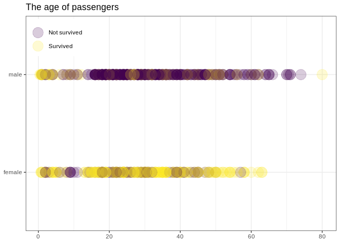

# Background story

In this lab assignment you are going to work with data related to the survival of passengers of the RMS Titanic. “The sinking of the Titanic is one of the most infamous shipwrecks in history. On April 15, 1912, during her maiden voyage, the widely considered “unsinkable” RMS Titanic sank after colliding with an iceberg. Unfortunately, there weren’t enough lifeboats for everyone onboard, resulting in the death of 1502 out of 2224 passengers and crew. While there was some element of luck involved in surviving, it seems some groups of people were more likely to survive than others.” (Quote from the Kaggle Titanic Challenge).

For the sake of this assignment, let’s imagine that you are called as an expert to a court case: Kate, one of the survivors of the Titanic accident is suing her __father, Leonardo, for not accompanying Kate and her mother Sue on the trip__ and this way decreasing their chances of survival. The family planned to move to the US back in 1912. __They bought 3rd class tickets for the three of them for 8 British Pounds each. (They did not get cabins with their 3rd class tickets.)__ The plan was that they embark in Southampton and all of them got on board, but Leonardo got separated from them in the rush of passengers during boarding. Later it turned out that Leonardo deliberately got separated from them and got off the boat before it’s departure, to run away and live with his mistress. __Kate was only 4 at the time, and Sue was 20.__ During the accident __Kate got on one of the last lifeboats and was later rescued, but there was no room for Sue on the lifeboat, and she did not survive the disaster.__

Now 20 years later Kate is suing her father for leaving them on the boat, because she thinks that this eventually led to Sue’s death, as the absence of Leonardo decreased their chances of survival.

You are called in as an expert to this court case. Your task is to present a report about whether the presence of Leonardo statistically could have led to an improved chance of survival.

# Dataset

Use the data file called ‘assignment_4_dataset’, from the 'data/' folder.

This is the training dataset of the Titanic dataset from the Kaggle Titanic Challenge (https://www.kaggle.com/c/titanic/overview), a prediction challenge for people who are just starting to learn about machine learning and other statistical prediction techniques. The following description is available for the dataset:

## Metadata


|Variable |Definition                                                        |Notes                                                                                                              |
|:--------|:-----------------------------------------------------------------|:------------------------------------------------------------------------------------------------------------------|
|survival |Survival                                                          |0 = No, 1 = Yes                                                                                                    |
|pclass   |Ticket class                                                      |1 = 1st, 2 = 2nd, 3 = 3rd                                                                                          |
|sex      |Sex                                                               |male or female                                                                                                     |
|Age      |Age in years                                                      |NA                                                                                                                 |
|sibsp    |Number of siblings or spouses accompanying the passenger on board |(for example if the passenger was traveling with 2 of his/her siblings and his/her spouse, this number would be 3) |
|parch    |Number of parents or children accompanying the passenger on board |(for example if the passenger was traveling just with his/her mother, this number would be 1)                      |
|ticket   |The ID number of the ticket                                       |NA                                                                                                                 |
|fare     |Passenger fare (in Pounds)                                        |NA                                                                                                                 |
|cabin    |Cabin number (if any)                                             |NA                                                                                                                 |
|embarked |Port of Embarkation                                               |C = Cherbourg, Q = Queenstown, S = Southampton                                                                     |

# Task

As usual, start with exploring your dataset. Do descriptive and exploratory analysis including visualization to understand the data and to see what type of data you are dealing with. 

You should buin challenges on Kaggle, so there is plenty of discussion and guides on the web about different models and features. If you get stuck, you can look these up to improve your prediction performance.
ld a statistical model with which you can accurately estimate Kate’s and Sue’s chances of survival. First you should fit a statistical model (for example a logistic regression model) on the dataset, calculate the regression equation, and use that equation to compute the survival probability for Kate and Sue separately with and without having Leonardo on board the ship with them.

You can use whichever predictor you would like, but you need to build a model that is at least as accurate so that it can correctly predict the outcome value within the sample with at least 72% accuracy for BOTH those who actually survived and who actually died in the disaster. You need to check this in the Classification table. So it is not enough to have 72% overall correct percentage! In order to be able to reach this prediction accuracy you might have to use some special predictors or to do some feature engineering. A comprehensive exploratory analysis including the visualisation of the relationship of different predictors might help in this. Keep in mind that this is one of the most popular predictio
You do not need to check model assumptions in this assignment (but you can do so if you want to and this might help you improve your prediction performance). 

# What to report

When you have arrived at a satisfactory model describe the final model to the reader so that it is clear how is the model built up, and that based on the description the reader could reproduce your model.

Report about the goodness of fit of the model, whether it is significantly better than the null model (based on the AIC and chi^2 test statistics), and how effective is your model at predicting the outcome (based on McFadden R^2, and the correct prediction percentages in the classification table of the final model). Be sure to report the total correct prediction percentage of the final model and also the correct prediction percentages separately for those who actually died, and those who actually survived.

Also, report the statistics describing the coefficients of the predictors in a table format (for each predictor, this table should include the following: logit regression coefficients, Odds ratios, and 95% confidence intervals for the Odds ratios, Chi^2 test statistics and p values, and AIC values for the reduced models). 

Report which were the most influential predictors in the model, and which were the predictors which did not seem to have unique added value to the model.

Write up the regression equation of the model in the form of 𝑌 = 𝑏0 + 𝑏1 ∗ X1 + 𝑏2 ∗ X2 +…+ bn * Xn, in which you use the actual regression coefficients of your models. (b0 stands for the intercept and b1, b2 … bn stand for the model coefficients for each of the predictors, and X1, X2, … Xn denote the predictors).

Finally, report the predicted probability of survival for Kate and Sue separately with and without having Leonardo on board the ship with them. (So you will have to estimate 4 probabilities in total, two for Kate and two for Sue). It is important that this is in the probability scale (since the jury does not know what logit means and how to interpret it).

# What to discuss

In your discussion of the findings, briefly interpret the results of the above analyses in light of the court case. Based on your results do you find it likely that the presence of Leonardo (spouse to Sue and parent to Kate) would have improved the survival chances of Sue and Kate? What is the best predictor of survival in the model and how does the presence of a spouse and presence of a parent compare to its influence?

# Solution

## Read the data

Read the dataset used in this assignment. Pay attention to the extension of the datafile.


```r
titanic_dataset <- haven::read_sav(here::here("~/Dokumentumok/3_phd_courses/r/assignment/public_r_data_analysis_2021_spring/data/assignment_6_dataset.sav")) %>%
  mutate(Survived = as.factor(Survived),
         Pclass = as.factor(Pclass),
         Sex = as.factor(Sex),
         Embarked = as.factor(Embarked),
         AgeCategory = cut(Age,
                           breaks = c(-Inf, 18, Inf),
                           labels = c("Child", "Adult")),
         Family = SibSp + Parch)

label_class = c ("1" = "1st Class", "2" = "2nd Class", "3" = "3rd Class")
label_sex = c("female" = "Females", "male" = "Males")
label_embarked = c("C" = "Cherbourg", "Q" = "Queenstown", "S" = "Southampton")
label_survived = c("0" = "Not survived", "1" = "Survived")
```

## EDA

### Survival age


```r
survival_age <- ggplot(titanic_dataset, aes(Sex, Age, color = Survived)) +
  geom_point(alpha = 0.2, size = 7) +
  labs(title = "The age of passengers") +
  xlab(NULL) +
  ylab(NULL) +
  theme(legend.title = element_blank(), legend.position = c(0.1, 0.9)) +
  scale_color_viridis(discrete = TRUE, labels = label_survived)
```

### Age freqency by survival


```r
class_freq <- ggplot(titanic_dataset, aes(Age, fill = Sex)) +
  geom_histogram(binwidth = 1) +
  facet_wrap(vars(Pclass), labeller = labeller(Pclass = label_class)) +
  labs(title = "Age of travellers in each class") +
  theme(legend.position = "bottom", legend.title = element_blank()) +
  scale_fill_viridis_d(labels = c("Not survived", "Survived"))

class_freq
```

```
## Warning: Removed 177 rows containing non-finite values (stat_bin).
```

<!-- -->


### Age freqency by port of embarkation


```r
port_freq <- ggplot(titanic_dataset, aes(Age, fill = Embarked)) +
  geom_histogram(binwidth = 1) +
  labs(title = "Age of travellers embarked in each port") +
  theme(legend.position = "bottom", legend.title = element_blank()) +
  scale_fill_viridis_d(labels = label_embarked)

port_freq
```

```
## Warning: Removed 177 rows containing non-finite values (stat_bin).
```

<!-- -->

### Survival frequency


```r
survival_freq <- ggplot(titanic_dataset, aes(Age, fill = Survived)) +
  geom_histogram(binwidth = 1) +
  facet_grid(cols = vars(Pclass), rows = vars(Sex), labeller = labeller(Pclass = label_class, Sex = label_sex)) +
  labs(title = "Age of survivers faceted by sex and class") +
  theme(legend.position = "bottom", legend.title = element_blank()) +
  scale_fill_viridis_d(labels = label_survived)

survival_freq
```

```
## Warning: Removed 177 rows containing non-finite values (stat_bin).
```

<!-- -->

### Survival proportion


```r
survival_prop <- ggplot(titanic_dataset, aes(Pclass, fill = Survived)) +
  geom_bar(position = "fill") +
  facet_wrap(vars(Sex), labeller = labeller(Sex = label_sex)) +
  labs(title = "Proportions of survival in each sex") +
  xlab("Passenger class") +
  ylab(NULL) +
  theme(legend.position = "bottom", legend.title = element_blank()) +
  scale_fill_viridis_d(labels = label_survived)

survival_prop
```

<!-- -->

### Survivel trendline faceted by Sex and Passenger Class


```r
titanic_dataset_log <- titanic_dataset %>%
mutate(Survived = as.numeric(as.character(Survived)))

survival_line <- ggplot(titanic_dataset_log, aes(Age, Survived)) +
   facet_grid(cols = vars(Pclass), rows = vars(Sex), labeller = labeller(Pclass = label_class, Sex = label_sex)) +
   geom_point() +
   geom_smooth(
     method = "glm", 
     color = "blue",
     se = FALSE, 
     method.args = list(family = binomial)
   )
 
survival_line
```

```
## `geom_smooth()` using formula 'y ~ x'
```

```
## Warning: Removed 177 rows containing non-finite values (stat_smooth).
```

```
## Warning: Removed 177 rows containing missing values (geom_point).
```

<!-- -->

## Clean the data


```r
clean_dataset <- titanic_dataset %>%
  dplyr::select(Survived, Age, Sex, Pclass, SibSp, Parch) %>%
  mutate(Pclass = as.numeric(as.character(Pclass))) %>%
  na.omit()
```

## Creating a datatable for Sue, Kate, and Leonardo


```r
Name <- c("Kate with Leo", "Sue with Leo", "Kate without Leo", "Sue without Leo")
Age <- c(4, 22, 4, 22)
SibSp <- c(0, 1, 0, 0)
Parch <- c(2, 1, 1, 1)
Sex <- c("female","female","female","female")
Pclass <- c(3,3,3,3)

family_data <- data.frame(Name, Age, SibSp, Parch, Pclass)
```

## Building the null model


```r
null_model <- glm(Survived ~ 1, data = clean_dataset, family = binomial)
summary(null_model)
```

```
## 
## Call:
## glm(formula = Survived ~ 1, family = binomial, data = clean_dataset)
## 
## Deviance Residuals: 
##    Min      1Q  Median      3Q     Max  
## -1.021  -1.021  -1.021   1.342   1.342  
## 
## Coefficients:
##             Estimate Std. Error z value Pr(>|z|)    
## (Intercept)  -0.3799     0.0762  -4.985  6.2e-07 ***
## ---
## Signif. codes:  0 '***' 0.001 '**' 0.01 '*' 0.05 '.' 0.1 ' ' 1
## 
## (Dispersion parameter for binomial family taken to be 1)
## 
##     Null deviance: 964.52  on 713  degrees of freedom
## Residual deviance: 964.52  on 713  degrees of freedom
## AIC: 966.52
## 
## Number of Fisher Scoring iterations: 4
```

## Building the model


```r
#filtering out sex and passenger class to improve the model
dataset_model <- clean_dataset %>%
  filter(Sex == "female")

model <- glm(Survived ~ Age + Pclass + SibSp + Parch, data = dataset_model, family = "binomial")
summary(model)
```

```
## 
## Call:
## glm(formula = Survived ~ Age + Pclass + SibSp + Parch, family = "binomial", 
##     data = dataset_model)
## 
## Deviance Residuals: 
##     Min       1Q   Median       3Q      Max  
## -3.1109   0.1201   0.2379   0.5390   1.7907  
## 
## Coefficients:
##             Estimate Std. Error z value Pr(>|z|)    
## (Intercept)  7.79290    1.16947   6.664 2.67e-11 ***
## Age         -0.03309    0.01499  -2.207   0.0273 *  
## Pclass      -2.24751    0.34713  -6.475 9.51e-11 ***
## SibSp       -0.40612    0.18671  -2.175   0.0296 *  
## Parch       -0.12103    0.15672  -0.772   0.4400    
## ---
## Signif. codes:  0 '***' 0.001 '**' 0.01 '*' 0.05 '.' 0.1 ' ' 1
## 
## (Dispersion parameter for binomial family taken to be 1)
## 
##     Null deviance: 290.76  on 260  degrees of freedom
## Residual deviance: 200.53  on 256  degrees of freedom
## AIC: 210.53
## 
## Number of Fisher Scoring iterations: 6
```

# Check the assumptions


```r
Survived_prob <- predict(model, family_data, type = "response")
Survived_odds <- Survived_prob / (1 - Survived_prob)


Family_data_assumption <- data.frame(family_data, Survived_prob, Survived_odds)
view(Family_data_assumption)
```

# Compare the models


```r
McFaden_R2 <- 1-(logLik(model) / logLik(null_model))

classDF <- data.frame(response = dataset_model$Survived, predicted = round(fitted(model),0))
class_table <- xtabs(~ predicted + response, data = classDF)

res <- chisq.test(dataset_model$Survived, round(fitted(model),0))

models <- list(null_model, model)
modelnames <- c("null model", "model")
aic <- aictab(cand.set = models, modnames = modelnames)
```

# Calculate odds ratio and confidence interval


```r
odds_and_conf <- logistic.display(model)
```

# Report the results

The build the model with higher accuracy I filtered out the female passengers. The age, the passenger class, the number of siblings or spouses accompanying the passenger, and the number of parents or children accompanying the passenger were entered as predictor values.
The model was fitted to all the passengers.


```r
broom::tidy(model, conf.int = TRUE, exponentiate = TRUE)
```

```
## # A tibble: 5 x 7
##   term        estimate std.error statistic  p.value conf.low conf.high
##   <chr>          <dbl>     <dbl>     <dbl>    <dbl>    <dbl>     <dbl>
## 1 (Intercept) 2423.       1.17       6.66  2.67e-11 293.     29527.   
## 2 Age            0.967    0.0150    -2.21  2.73e- 2   0.938      0.996
## 3 Pclass         0.106    0.347     -6.47  9.51e-11   0.0503     0.198
## 4 SibSp          0.666    0.187     -2.18  2.96e- 2   0.454      0.949
## 5 Parch          0.886    0.157     -0.772 4.40e- 1   0.641      1.19
```

```r
odds_and_conf
```

```
## 
## Logistic regression predicting Survived : 1 vs 0 
##  
##                     crude OR(95%CI)   adj. OR(95%CI)    P(Wald's test)
## Age (cont. var.)    1.02 (1,1.04)     0.97 (0.94,1)     0.027         
##                                                                       
## Pclass (cont. var.) 0.13 (0.07,0.23)  0.11 (0.05,0.21)  < 0.001       
##                                                                       
## SibSp (cont. var.)  0.64 (0.48,0.85)  0.67 (0.46,0.96)  0.03          
##                                                                       
## Parch (cont. var.)  0.68 (0.53,0.87)  0.89 (0.65,1.2)   0.44          
##                                                                       
##                     P(LR-test)
## Age (cont. var.)    0.023     
##                               
## Pclass (cont. var.) < 0.001   
##                               
## SibSp (cont. var.)  0.024     
##                               
## Parch (cont. var.)  0.433     
##                               
## Log-likelihood = -100.2653
## No. of observations = 261
## AIC value = 210.5306
```

```r
aic
```

```
## 
## Model selection based on AICc:
## 
##            K   AICc Delta_AICc AICcWt Cum.Wt      LL
## model      5 210.77       0.00      1      1 -100.27
## null model 1 966.52     755.76      0      1 -482.26
```

```r
McFaden_R2
```

```
## 'log Lik.' 0.792092 (df=5)
```

```r
class_table
```

```
##          response
## predicted   0   1
##         0  34  13
##         1  30 184
```

```r
res
```

```
## 
## 	Pearson's Chi-squared test with Yates' continuity correction
## 
## data:  dataset_model$Survived and round(fitted(model), 0)
## X-squared = 67.706, df = 1, p-value < 2.2e-16
```

